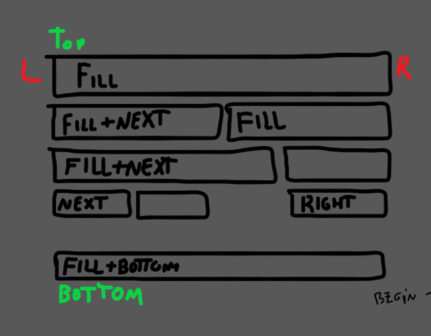

# Overview

Here you will read these topics:
- Fundamentals
- Example
# Fundamentals

The docking system of the layout service runs for all containers, which means, the processing only works for the container category. The processing is invoked when necessary, every change on stacked widgets, like size, and position, dispatch the layout [task](../core/eventtask.md).

A widget can be aligned by following docks:  
`fill` `next` `none` `right` `bottom`  

By default, the docking is automatically `left`-aligned and `top`-aligned.

This is a behavior for non `free` widgets, the `free` docking possibility the widget be created in any position, but not all widgets can do that, only specific like frame, listbox, and popup widgets. 

